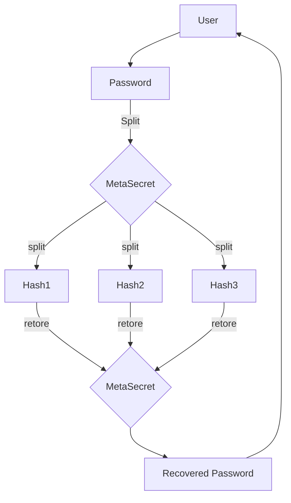

<p align="center">
  
</p>

## Application Design




## Command Line App

#### Split secrets:
You can split and restore your secrets by using meta-secret cli app in docker.
<br>
Imagine that we want to split `top$ecret`, then the command will be: 

```bash
$ mkdir secrets
$ docker run -ti --rm -v $(pwd)/secrets:/app/secrets ghcr.io/meta-secret/meta-secret-cli:latest split --secret top$ecret 
```

It will generate json/qr(jpg) files (shares of your secert) in the `secrets` directory.

#### Restore secrets:
When it comes to restore the secret, put json or qr files (shares of your secret) into the `secrets` directory.
Then run in case of qr (if you want restore from json, just pass --from json ):

```bash
$ docker run -ti --rm -v $(pwd)/secrets:/app/secrets ghcr.io/meta-secret/meta-secret-cli:latest restore --from qr 
```

## Advice for VPS-users
If you don't want to use FileZilla to download QR-codes to see on your computer, you can see them in terminal.

#### Installation
```bash
$ brew install qrencode (MacOS)
$ apt-get install qrencode (Debian/Ubuntu)
$ dnf install qrencode (CentOS/Rocky/Alma)
```

#### Showing QR codes in terminal
```bash
$ qrencode -t ansiutf8 < meta-secret-1.json
```

Congrats! Save these codes in secure place!

Below is optional
If you would like to extract data from QR's
  * Just take a phone to scan QR
  * or screenshot the terminal and upload it on this website: [webqr.com](https://webqr.com)

<br>
